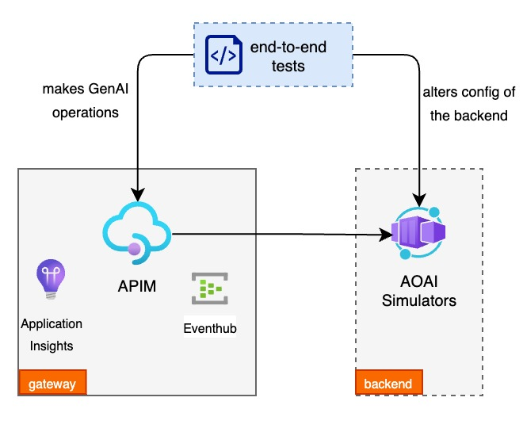

# GenAI Gateway Toolkit using API Management (APIM)

- [GenAI Gateway Toolkit using API Management (APIM)](#genai-gateway-toolkit-using-api-management-apim)
	- [Introduction](#introduction)
		- [GenAI Gateway](#genai-gateway)
	- [Architecture](#architecture)
	- [Getting Started](#getting-started)
		- [Using Visual Studio Code Dev Containers](#using-visual-studio-code-dev-containers)
		- [Prerequisites for non Dev Container setup](#prerequisites-for-non-dev-container-setup)
	- [Deploying the Accelerator](#deploying-the-accelerator)
	- [Gateway Capabilities](#gateway-capabilities)
	- [Gateway Backend Options](#gateway-backend-options)
	- [Testing Gateway Capabilities](#testing-gateway-capabilities)
	- [Troubleshooting](#troubleshooting)

## Introduction

The aim of this toolkit is to provide a quick start for deploying a GenAI Gateway using Azure API Management (APIM), and to demonstrate some of the GenAI capabilities in a controlled environment.

The APIM gateway that's provisioned by this toolkit contains policies that demonstrate different [GenAI Gateway capabilities](#gateway-capabilities) and the `end-to-end` tests allows to simulate different scenarios and demonstrate the capabilities by adjusting the configuration of the [OpenAI API simulator](https://github.com/microsoft/aoai-api-simulator) that's used as a backend.

<video src="https://github.com/Azure-Samples/apim-genai-gateway-toolkit/assets/16926044/b1844049-01b3-4956-822b-eb6cb3f99c1c" title="demo" width="360" height="240" controls></video>

### GenAI Gateway

A "GenAI Gateway" serves as an intelligent interface/middleware that dynamically balances incoming traffic across backend resources to achieve optimizing resource utilization. In addition to load balancing, GenAI Gateway can be equipped with extra capabilities to address the challenges around billing, monitoring etc.

To read more about considerations when implementing a GenAI Gateway, see [this article](https://learn.microsoft.com/ai/playbook/technology-guidance/generative-ai/dev-starters/genai-gateway/).

## Architecture

At a high level the toolkit contains 3 main components,

1. **APIM Gateway** - The API Management Gateway that will host the GenAI Gateway policies.
2. [**OpenAI API Simulator**](https://github.com/microsoft/aoai-api-simulator) - A simple API that simulates the OpenAI API. The simulator will allow to control the latency, and response to simulate different scenarios.
3. **End-to-End Tests** - A set of tests that will demonstrate the GenAI Gateway capabilities in action. These are python scripts written on top of locust.io to simulate the traffic and demonstrate the capabilities.



## Getting Started

To see the policies in action you need to set up your environment (you will need an Azure Subscription to deploy into).

For this you can either install the [pre-requisites](#prerequisites-for-non-dev-container-setup) on your local machine or use the [Visual Studio Code Dev Containers](#using-visual-studio-code-dev-containers) to set up the environment.

### Using Visual Studio Code Dev Containers

Follow the [Dev Containers Getting Started Guide](https://code.visualstudio.com/docs/devcontainers/containers) to set up Visual Studio Code for using Dev Containers.

Once that is done, open the repository in Visual Studio Code and select `Dev Containers: Reopen in Container` from the command palette.
This will create an environment with all the pre-requisites installed.

NOTE: When the container is built Visual Studio Code will automatically install the python dependencies required for the end-to-end capability tests. If you pull a later version of the code, you make need to run `pip install -r end_to_end_tests/requirements.txt` to install the dependencies (or rebuild the dev container).

### Prerequisites for non Dev Container setup

If you are manually installing the pre-requisites, you will need the following:

- Azure CLI
  - including the `application-insights` extension (`az extension add --name  application-insights`)
- Docker (if using the OpenAI API simulator)
- Python 3 (to run end-to-end tests)
- `jq` (to parse JSON responses in bash scripts)
- a bash terminal (see [Windows Subsystem for Linux](https://learn.microsoft.com/en-us/windows/wsl/install) if you are on Windows)
- Install python dependencies for the end-to-end tests by running `pip install -r end_to_end_tests/requirements.txt`

## Deploying the Accelerator

To see the GenAI Gateway capabilities in action, you can deploy the infrastructure using the provided Bicep templates.  

1. The templates require parameters set via an .env file and the project contains a [`sample.env`](./sample.env) with the required environment variables. Rename `sample.env` to `.env` and set the values accordingly.

2. Sign in with the Azure CLI:

	```bash
	az login
	```

3. Deploy the Bicep infrastructure:

	```bash
	./scripts/deploy.sh
	```

## Gateway Capabilities

This repo currently contains the policies showing how to implement these GenAI Gateway capabilities:

| Capability                                                                    | Description                                                                                                               |
| ----------------------------------------------------------------------------- | ------------------------------------------------------------------------------------------------------------------------- |
| [Latency based routing](./capabilities/latency-routing/README.md)             | Route traffic to the endpoint with the lowest latency.                                                                    |
| [Load balancing (round-robin)](./capabilities/load-balancing/README.md)       | Load balance traffic across PAYG endpoints using round-robin algorithm.                                                   |
| [Managing spikes with PAYG](./capabilities/manage-spikes-with-payg/README.md) | Manage spikes in traffic by routing traffic to PAYG endpoints when a PTU is out of capacity.                              |
| [Prioritization](./capabilities/prioritization/README.md)                     | Enable prioritization between requests and dynamically apply throttling to low-priority requests when capacity is limited |
| [Tracking token usage](./capabilities/usage-tracking//README.md)              | Record the token consumption for usage tracking and attribution                                                           |

## Gateway Backend Options

The toolkit is designed to deploy the API Management gateway alongside the OpenAI API Simulator, but can be used with Azure Open AI instances as well.

To use the simulator, set the `USE_SIMULATOR` option in your `.env` file to `true`.

To use Azure OpenAI backends instead, set the `USE_SIMULATOR` option in your `.env` file to `false`, and add the base URLs and API Keys for each backend (`PTU_DEPLOYMENT_1_BASE_URL`, `PTU_DEPLOYMENT_1_API_KEY`, etc.).

## Testing Gateway Capabilities

> [!CAUTION]
> Testing gateway capabilities with live Azure OpenAI backends, rather than the OpenAI API Simulator, will result in increased costs.

The easiest way to see the gateway capabilities in action is to deploy the gateway along with the OpenAI API Simulator. Once you have the gateway and simulator deployed, see the `README.md` in the relevant capability folder for instructions on how to test the capability. (NOTE: currently not all capabilities have tests implemented)

## Troubleshooting

- The rate limiting API's name changed (June 2024), which causes conflicting paths if you deployed prior to the change and want to redeploy. The error message received is `Cannot create API 'aoai-api-rate-limiting' with the same Path 'rate-limiting/openai' as API 'aoai-api-rate-limting'  unless it's a part of the same version set`. To fix the issue, you'll need to delete the existing `aoai-api-rate-limting` API and redeploy the project, or freshly redeploy from scratch.
