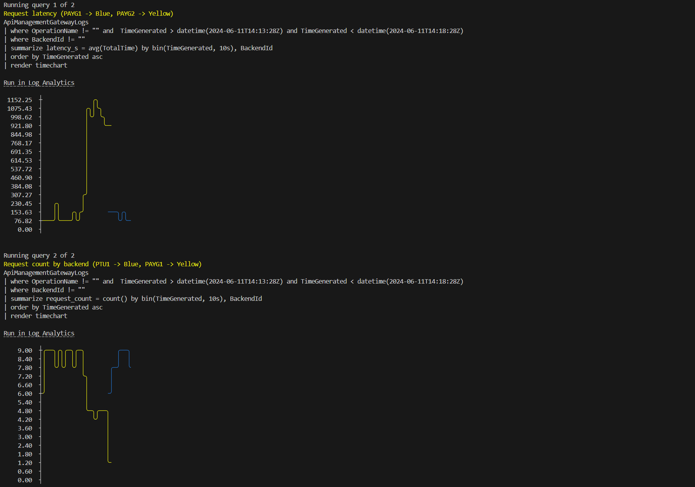

# Latency based routing

## Capability

In this capability we have multiple backends and want to route to whichever backend has the lowest latency.

## How the capability works

To achieve the latency-based routing, the API Management (APIM) configuration includes policies that utilize data specifying the preferred backend order, from the least to most latent.
The preferred backends are stored in the cache and the cache value can be updated by calling an API endpoint added specifically for this purpose (`/helpers/set-preferred-backends`).

Since different calls to OpenAI will have different expected latencies (based on token count, etc.), it wouldn't make sense to use the measured latencies of live traffic to make the routing decision.
Instead, a scheduled task outside of APIM periodically measures the current latency of the backends using the same query for each backend.
Using this data, the task calls the `/helpers/set-preferred-backends` endpoint to update the preferred backend order.

The different components in this setup are shown below:

```asciiart
                                                                                                          
                                                  +------------------+                                    
                    +------------------+          |                  |                                    
+-----------+       |                  +--------->|  OpenAI (PAYG1)  |           +-----------------------+
|           |       |                  |          |                  |<----------+                       |
|  Client   +------>|  Gen AI Gateway  |          +------------------+           |   Scheduled Task      |
|           |       |  (APIM)          |                                         |   (measure latency    |
|           |       |                  |          +------------------+           |    and update APIM)   |
+-----------+       |                  +--------->|                  |<----------+                       |
                    +------------------+          |  OpenAI (PAYG2)  |           +--------+--------------+
                       ^                          |                  |                    |               
                       |                          +------------------+                    |               
                       |                                                                  |               
                       |/helpers/set-preferred-backends                                   |               
                       |                                                                  |               
                       +------------------------------------------------------------------+               
                                                                                                          
```

To summarize:

- Using the `set-preferred-backends` endpoint, the preferred backends are stored in the cache. The preferred backends are an array of backend IDs of the hosts in the preferred order.
- The `latency-routing` policy will use the `preferred-backends` array from cache to route the request to the preferred instance.
- In cases, where the `preferred-instance` responds back with 429s, the request will then be routed to the second preferred instance.

## How to see this in action

To see this policy in action, first deploy the accelerator using the instructions [here](../../README.md) setting the `USE_SIMULATOR` value to `true`.
This will deploy OpenAI API simulators to enable testing the APIM policies without the cost of Azure OpenAI API calls.

Once the accelerator is deployed, open a bash terminal in the root directory of the repo and run `./scripts/run-end-to-end-latency-routing.sh`.

This script runs a load test for 5 minutes, which repeatedly sends requests to the OpenAI simulator via APIM using the latency routing policy.

1. When the script starts, it configures the latencies for the simulated APIs so that PAYG1 is fast and PAYG2 is slow.

2. Every minute, the script measures the latency of the backend APIs and calls the `set-preferred-backends` endpoint in APIM to pass the ordered list of backends (fastest first). This simulates the scheduled task in the diagram above.

3. Two minutes into the test, the script re-configures the simulator latencies so that PAYG1 is slow and PAYG2 is fast. This occurs just after the backend latencies are measured, so there is a minute of the test where the APIM latency information is stale. During this time the request latency via APIM will be higher.

4. A minute after the backend latencies were re-configured, the latencies are measured again and the `set-preferred-backends` endpoint is called to pass the new ordered list of backends. After this point, the latency of calls via APIM is reduced as the policy is routing to the current faster API.

After the load test is complete, the script waits for the metrics to be ingested into Log Analytics and then queries the results.

The initial output from a test run will look something like this:


In the above output, you can see each of the steps outlined in the description of the test steps.
Notice that after the `Updating simulator latencies` output, the order of the backends is changed and the PAYG2 endpoint is now listed first (and with the lower latency).

Once the metrics have been ingested, the script will show the results of a couple of queries that illustrate the behaviour:



For each of these queries, the query text is included, as well as a `Run in Log Analytics` link, which will take you directly to the Log Analytics blade in the Azure Portal so that you can run the query and explore the data further.

The first query shows the mean request latency for requests sent via the APIM gateway, broken out by the backend API used.
In this chart, you can see the spike that occurs after the backend latencies are re-configured and before APIM is updated with the latest latency data:


The second query shows the total number of requests sent to each backend API.
In this chart, you can see the spike in number of requests routed to PAYG2 at the same time that the latency spiked for PAYG1:


