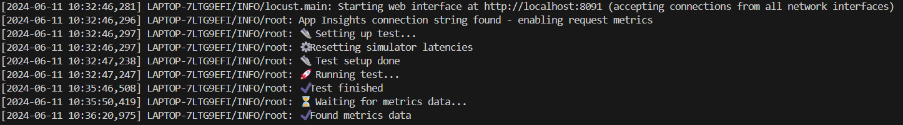
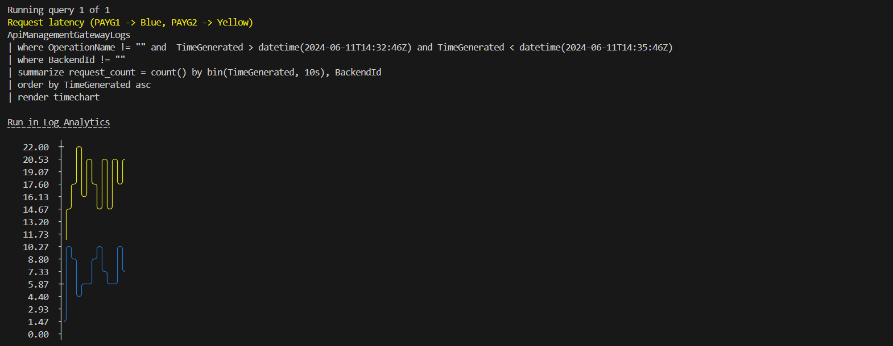
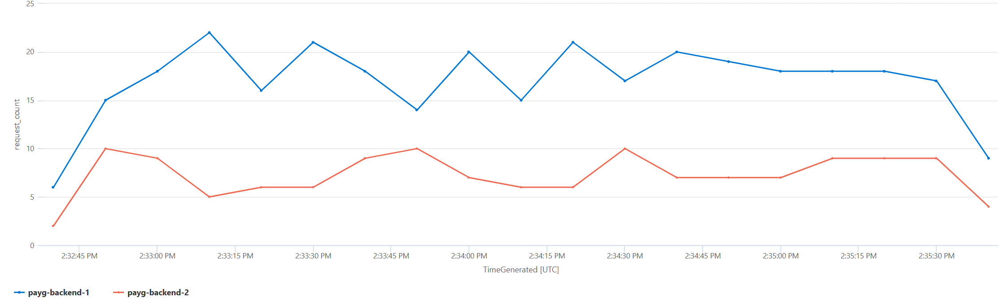

# Load balancing across PAYG, PTU instances

## Capability

In these capabilities, requests are routed evenly (simple) and with specific percentages (weighted) across multiple backends via infrastructure configuration. Policy based load balancing is implemented in [load-balancing](../load-balancing/README.md).

## How the infrastructure configuration works

### Simple Round Robin

- The API Management backends are defined as a pool.
- Equal weights and priorities are applied to each backend in the pool.
- Requests are routed to the backend pool.

### Weighted Round Robin

- The API Management backends are defined as a pool.
- Specific, unique weights are applied to each backend in the pool.
- Equal priorities are applied to each backend.
- Requests are routed to the backend pool.

## How to see this in action

To see this policy in action, first deploy the accelerator using the instructions [here](../../README.md) setting the `USE_SIMULATOR` value to `true`.
This will deploy OpenAI API simulators to enable testing the APIM policies without the cost of Azure OpenAI API calls.

Once the accelerator is deployed, open a bash terminal in the root directory of the repo and run either `./scripts/run-end-to-end-round-robin-simple-v2.sh` or `./scripts/run-end-to-end-round-robin-weighted-v2.sh`, depending on which version of the policies you want to test.

This script runs a load test for 3 minutes, which repeatedly sends requests to the OpenAI simulator via APIM using the either the simple or weighted round robin policy.

After the load test is complete, the script waits for the metrics to be ingested into Log Analytics and then queries the results.

The initial output from a test run will look something like this (this output shows the result of the weighted round robin policy):

Once the metrics have been ingested, the script will show the query results that illustrate the behaviour:

The query text is included, as well as a `Run in Log Analytics` link, which will take you directly to the Log Analytics blade in the Azure Portal so that you can run the query and explore the data further.

The query in this example shows the request count over time for each of the backend APIs.
In this chart, you can see the split of requests between the two backends over time:

