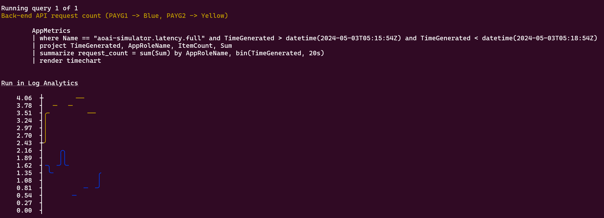
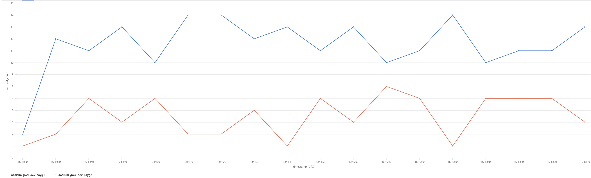

# Load balancing across PAYG, PTU instances

## Scenario

There are 2 different flavours of load balancing implemented: simple round robin and weighted round robin.

## How the policy works

### Simple Round Robin

- All the pool of endpoints are defined as an array.
- Each time a request is received the counter is incremented and persisted
- The counter value is used to select the endpoint from the array (using `random_value % backend_count`).
- The selected endpoint is then used to route the request.

### Weighted Round Robin

- All the pool of endpoints are defined as an `JArray` along with the weights for each endpoint.
- A random number is generated from 0 to the sum of all the weights.
- The endpoint is selected based on the random number generated, which is then used to route the request.
- There is no persistence of the counter in this case.

## How to see this in action

To see this policy in action, first deploy the accelerator using the instructions [here](../../README.md) setting the `USE_SIMULATOR` value to `true`.
This will deploy OpenAI API simulators to enable testing the APIM policies without the cost of Azure OpenAI API calls.

Once the accelerator is deployed, open a bash terminal in the route directory of the repo and run either `./scripts/run-end-to-end-round-robin-simple.sh` or `./scripts/run-end-to-end-round-robin-weighted.sh` depending on which version of the policies you want to test.

This script runs a load test for 3 minutes which repeatedly sends requests to the OpenAI simulator via APIM using the either the simple or weighted round robin policy.

After the load test is complete, the script waits for the metrics to be ingested into Application Insights and then queries the results.

The initial output from a test run will look something like this (this output shows the result of the weighted round robin policy):

In the above output you can see each of the steps outlined in the description of the test steps.
Notices that after the `Updating simulator latencies` output, the order of the backends is changed and the PAYG2 endpoint is now listed first (and with the lower latency).

Once the metrics have been ingested the script will show the results of a couple of queries that illustrate the behaviour:

For each of these queries the query text is included as well as a `Run in App Insights` link which will take you directly to the Application Insights blade in the Azure Portal so that you can run the query and explore the data further.

The query in this example shows the request count over time for each of the back-end APIs.
In this chart you can see the split of requests between the two back-ends over time:

