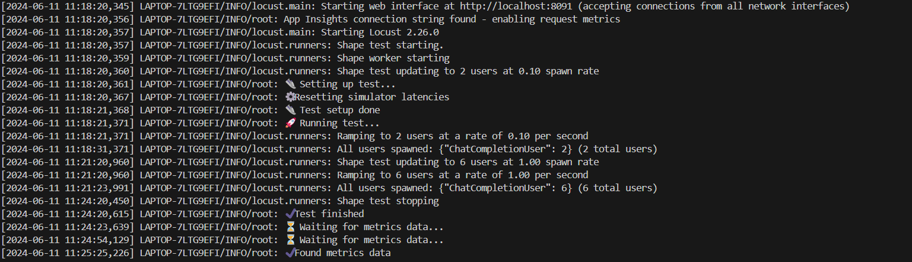
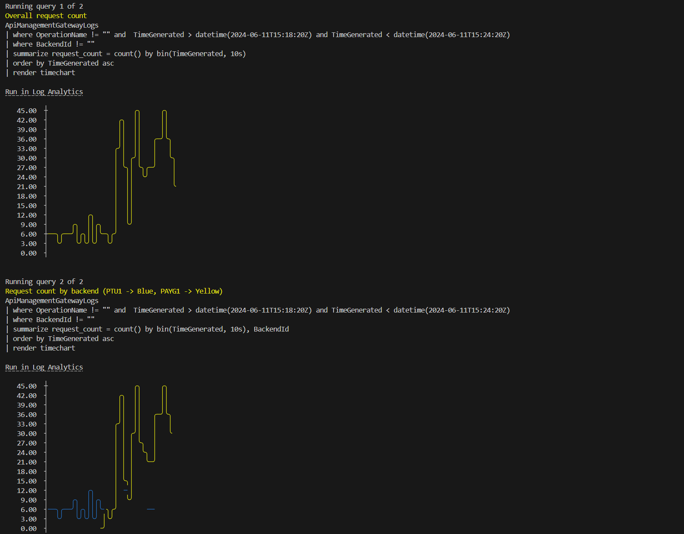
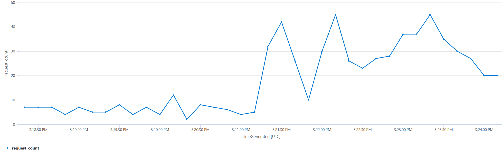
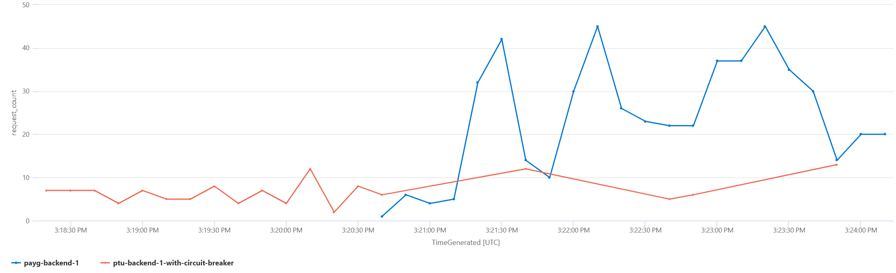

# Managing spike across PTU instances using PAYG deployments.

## Capability

In this capability, traffic is routed to the PTU1 instance as the primary backend. When the PTU1 instance returns a 429 Retry response, the request is re-submitted to the PAYG1 instances via infrastructure configuration. Policy based spillover is implemented in [manage-spikes-with-payg](../manage-spikes-with-payg/README.md).

## How the infrastructure configuration works

- The API Management PTU backend is configured with circuit breaker properties that define the number of 429s it should retry on.
- The API Management backends are defined as a pool.
- Equal weights are applied to each backend in the pool.
- The API Management PTU backend receives a higher priority than the PAYG1 backend within the pool.
- Requests are routed to the backend pool.
- When the number of configured 429s occurs in the configured interval, requests will be routed to the next backend in the pool, PAYG1.

## How to see this in action

To see this policy in action, first deploy the accelerator using the instructions [here](../../README.md) setting the `USE_SIMULATOR` value to `true`.
This will deploy OpenAI API simulators to enable testing the APIM policies without the cost of Azure OpenAI API calls.

Once the accelerator is deployed, open a bash terminal in the root directory of the repo and run `./scripts/run-end-to-end-manage-spikes-with-payg-v2.sh`.

This script runs a load test for 6 minutes, which repeatedly sends requests to the OpenAI simulator via APIM using the retry with pay as you go policy.
Partway through the test, the user count is increased to generate a spike in traffic.

After the load test is complete, the script waits for the metrics to be ingested into Log Analytics and then queries the results.

The initial output from a test run will look something like this:

Once the metrics have been ingested the script will show the results of a couple of queries that illustrate the behaviour:

For each of these queries, the query text is included, as well as a `Run in Log Analytics` link, which will take you directly to the Log Analytics blade in the Azure Portal so that you can run the query and explore the data further.

The first query shows the total number of requests sent to each backend API and you can see the spike in traffic.

The second query breaks the request count out for each of the backend APIs. In this chart, you can see that the requests were almost exclusively handled by the PTU1 instance until the spike in traffic when the PAYG1 instance started to handle some of the requests.

