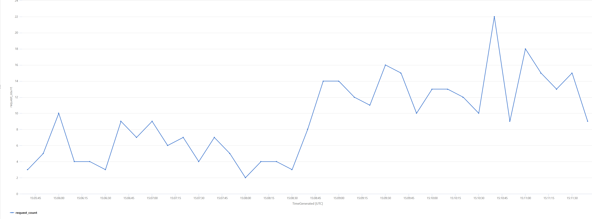

# Managing spike across PTU instances using PAYG deployments.

## Scenario

In this scenario, the traffic is routed to the PTU1 instance as the primary backend. When the PTU1 instance returns a 429 Retry response the request is re-submitted to the PAYG1 instance.

## How the policy works

- This scenario leverages the APIM [`retry` policy](https://learn.microsoft.com/en-us/azure/api-management/retry-policy)

- The segment in the retry policy will execute **at least once** and when the response is null (request entering first time into the retry segment) then it will be routed to the PTU instance.

- If the PTU instance responds back with 429, then the request will be routed to the PAYG instance.

## How to see this in action

To see this policy in action, first deploy the accelerator using the instructions [here](../../README.md) setting the `USE_SIMULATOR` value to `true`.
This will deploy OpenAI API simulators to enable testing the APIM policies without the cost of Azure OpenAI API calls.

Once the accelerator is deployed, open a bash terminal in the route directory of the repo and run `./scripts/run-end-to-end-manage-spikes-with-payg.sh`.

This script runs a load test for 6 minutes which repeatedly sends requests to the OpenAI simulator via APIM using the either the simple or weighted round robin policy.
Partway through the test, the user count is increased to generate a spike in traffic.

After the load test is complete, the script waits for the metrics to be ingested into Log Analytics and then queries the results.

The initial output from a test run will look something like this:

Once the metrics have been ingested the script will show the results of a couple of queries that illustrate the behaviour:

For each of these queries the query text is included as well as a `Run in Log Analytics` link which will take you directly to the Log Analytics blade in the Azure Portal so that you can run the query and explore the data further.

The first query in this shows the overall request count over time and you can see the increase in traffic.
The second breaks the request count out for each of the back-end APIs, showing that the requests were almost exclusively handled by the PTU1 instance until the spike in traffic when the PAYG1 instance started to handle some of the requests.

These queries can also been viewed in Log Analytics

