# Prioritization - Token Calculating - Single Priority Tests

This doc describes the end-to-end tests that send either just high or low priority embeddings requests.
For details of the policy implementation and other tests, see the [Prioritization Token Calculating README](./prioritization-token-calculating.md).

To see this policy in action, first deploy the accelerator using the instructions [here](../../README.md) setting the `USE_SIMULATOR` value to `true`.
This will deploy OpenAI API simulators to enable testing the APIM policies without the cost of Azure OpenAI API calls.

## Running the low priority test

Once the accelerator is deployed, open a bash terminal in the root directory of the repo and run `LOAD_PATTERN=low-priority ENDPOINT_PATH=prioritization-token-calculating REQUEST_TYPE=embeddings ./scripts/run-end-to-end-prioritization.sh`. The command will run a prioritization end to end test against the token calculating endpoint using embeddings requests.

This script runs a load test that sends low priority embeddings requests over the course of five minutes.

After the load test is complete, the script waits for the metrics to be ingested into Log Analytics and then queries the results.

The initial output from a test run will look something like this:

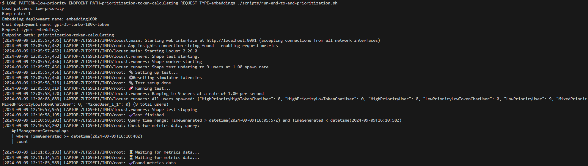

Once the metrics are ingested, the script will show the results of a number of queries that illustrate the behaviour (truncated for length):

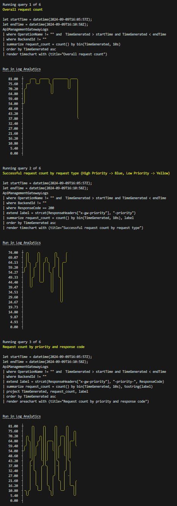

For each of these queries, the query text is included, as well as a `Run in Log Analytics` link, which will take you directly to the Log Analytics blade in the Azure Portal so that you can run the query and explore the data further.

The first query shows the overall request count and shows that the number of low priority requests increases, then holds steady:

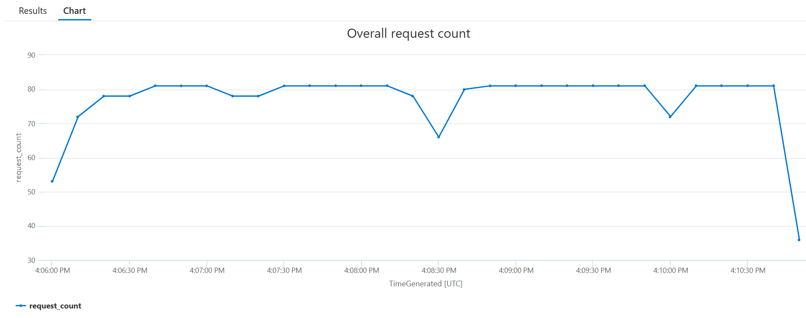

The next query shows the number of successful requests (i.e. with a 200 status response) split by priority. Here you can see that the low priority requests show success in waves as the request and token tracking windows progress and 429s are returned when limits are reached:

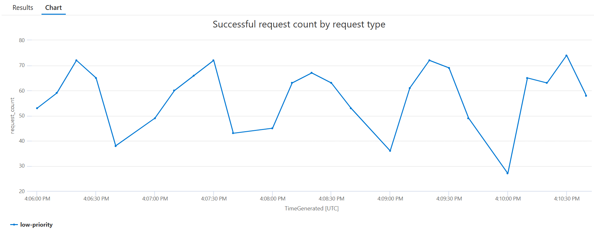

The third query shows all responses split by priority and response status code. This has more detail than the previous query and shows that there are 429 responses for low priority requests when there is not enough capacity available:

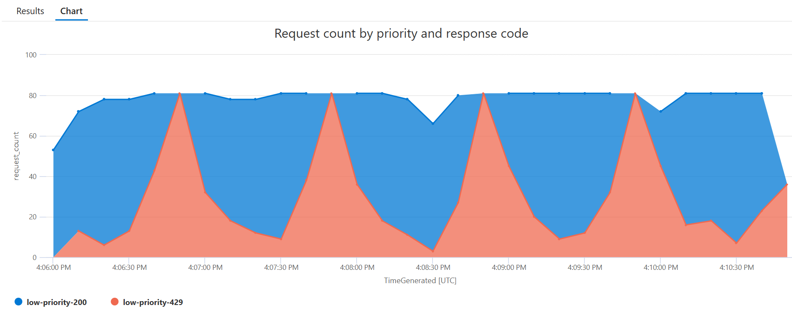

The next query shows the remaining tokens value (min/max/mean) over time, taken from the backend service response headers:

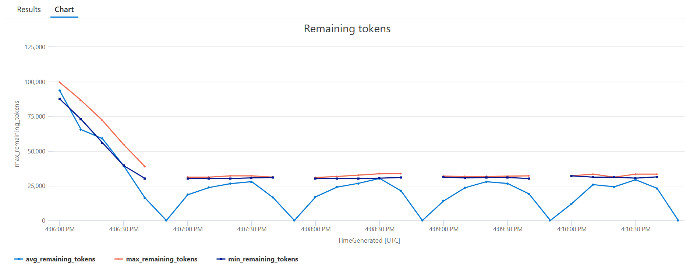

The next query uses metrics from the Azure OpenAI API simulator to show the rate limit token usage over time showing both the point in time value and the 60s sliding total. This is a useful way to evaluate the effectiveness of the policy:

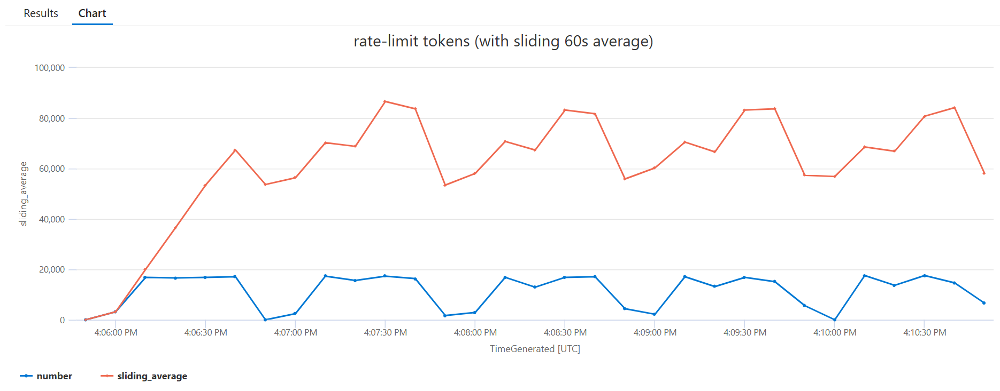

The final query displays the `consumed-tokens` values that API Management tracks and uses to determine if there is available capacity for a given embeddings request.

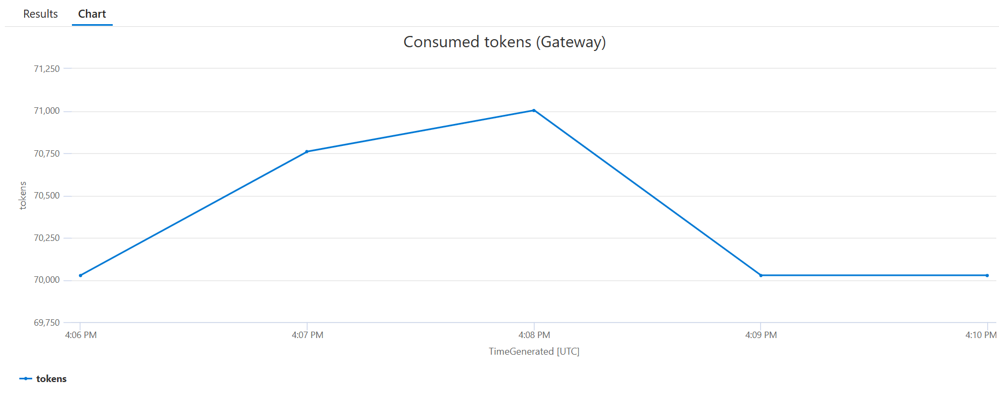

## Running the high priority test

Once the accelerator is deployed, open a bash terminal in the root directory of the repo and run `LOAD_PATTERN=high-priority ENDPOINT_PATH=prioritization-token-calculating REQUEST_TYPE=embeddings ./scripts/run-end-to-end-prioritization.sh`. The command will run a prioritization end to end test against the token calculating endpoint using embeddings requests.

This script runs a load test that sends high priority embeddings requests over the course of five minutes.

After the load test is complete, the script waits for the metrics to be ingested into Log Analytics and then queries the results.

The initial output from a test run will look something like this:

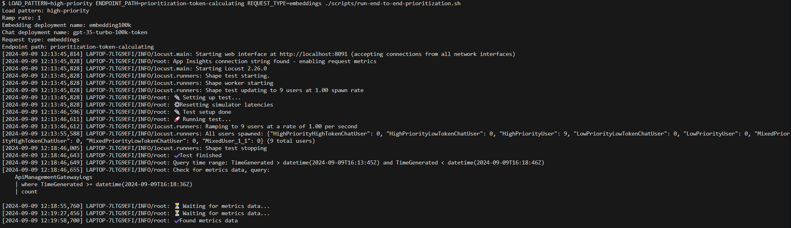

Once the metrics are ingested, the script will show the results of a number of queries that illustrate the behaviour (truncated for length):

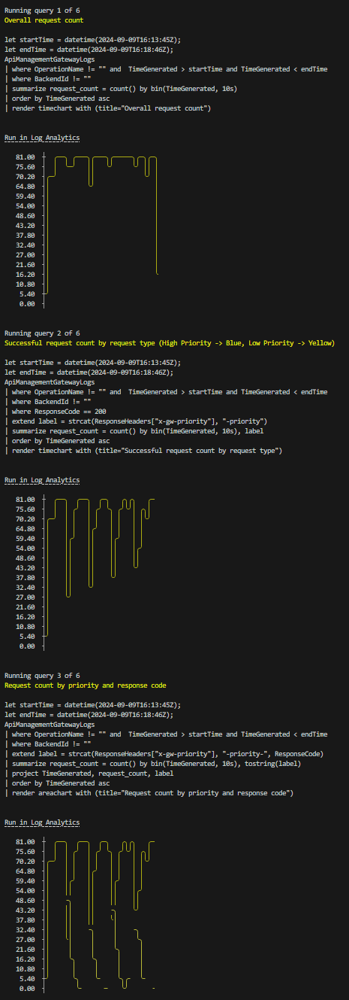

For each of these queries, the query text is included, as well as a `Run in Log Analytics` link, which will take you directly to the Log Analytics blade in the Azure Portal so that you can run the query and explore the data further.

The first query shows the overall request count and shows that the number of high priority requests increases, then holds steady:

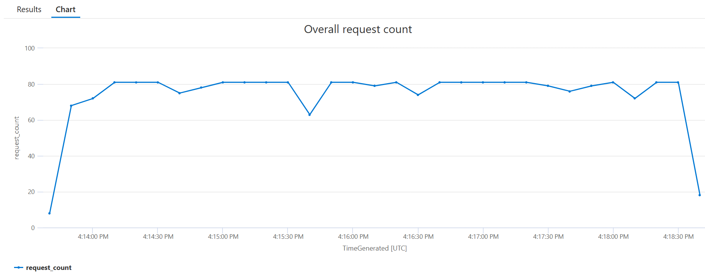

The next query shows the number of successful requests (i.e. with a 200 status response) split by priority. The high priority requests show success in similar waves as the request and token tracking windows progress and 429s are returned when limits are reached. When compared with the low priority test, however, you can see that 429 spikes are lower and less frequent, as high priority limits are higher:

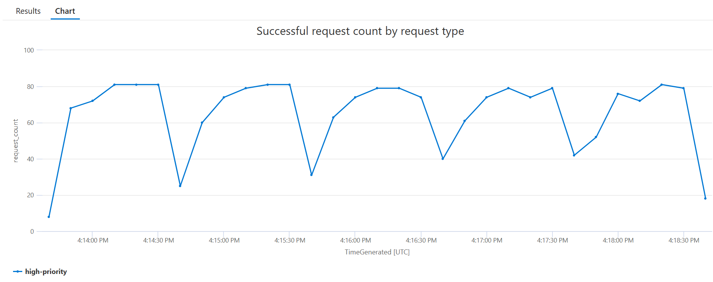

The third query shows all responses split by priority and response status code. This has more detail than the previous query and shows that there are 429 responses for high priority requests when there is not enough capacity available:

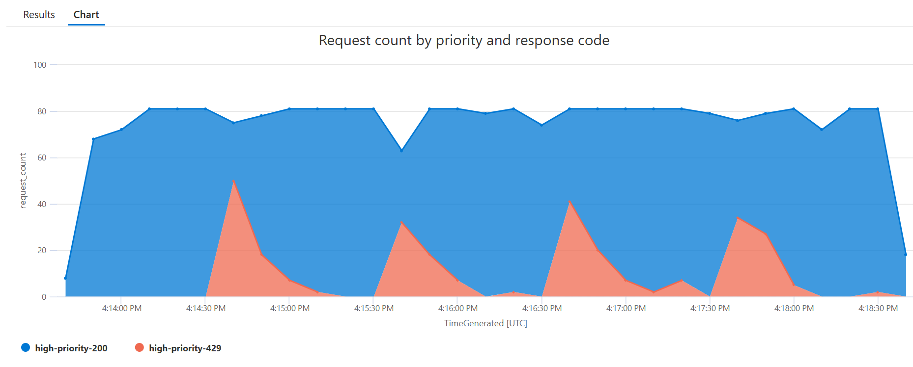

The next query shows the remaining tokens value (min/max/mean) over time, taken from the backend service response headers:

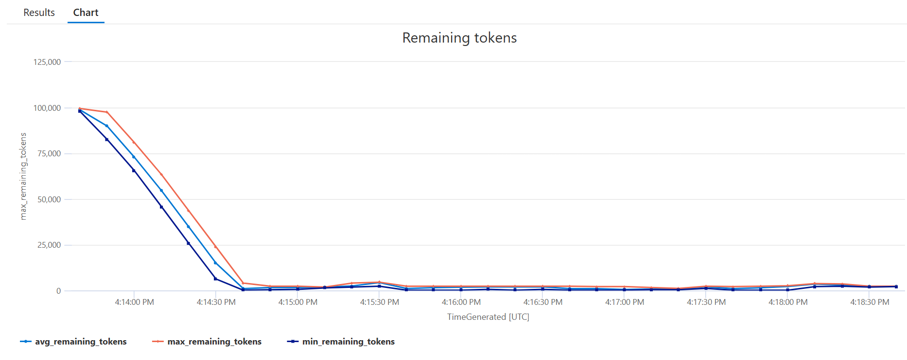

The next query uses metrics from the Azure OpenAI API simulator to show the rate limit token usage over time showing both the point in time value and the 60s sliding total. This is a useful way to evaluate the effectiveness of the policy:

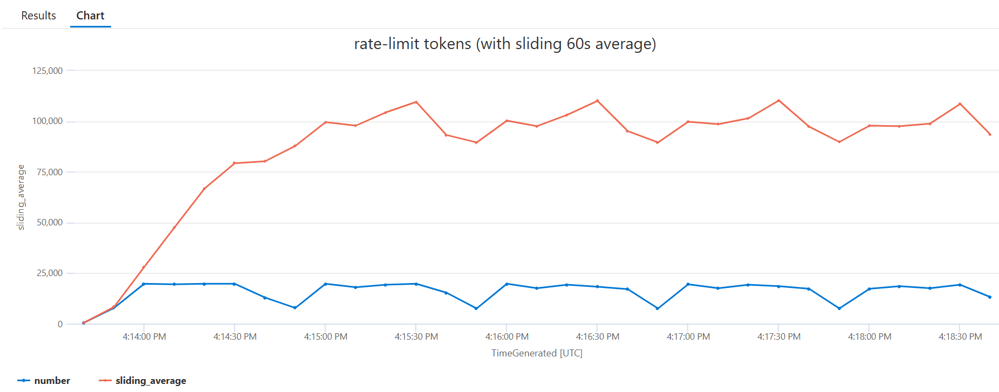

The final query displays the `consumed-tokens` values that API Management tracks and uses to determine if there is available capacity for a given embeddings request.

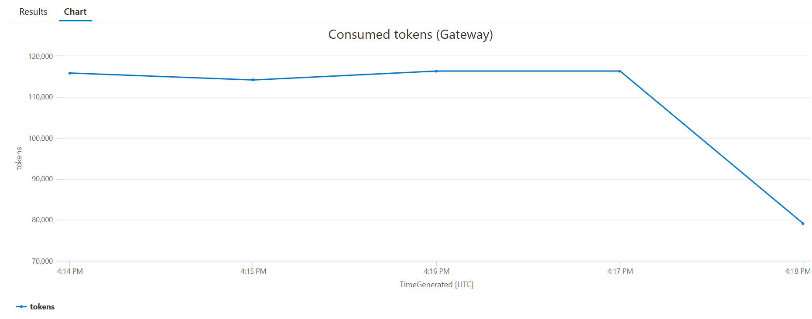
