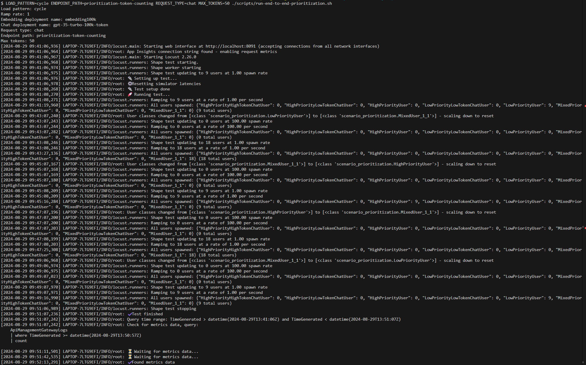
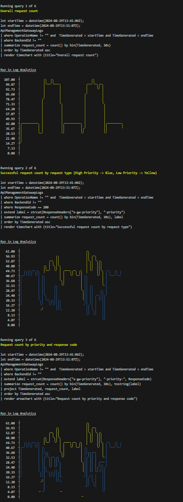
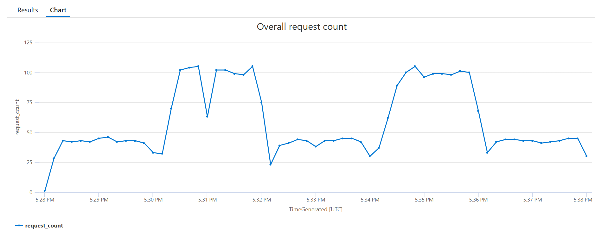
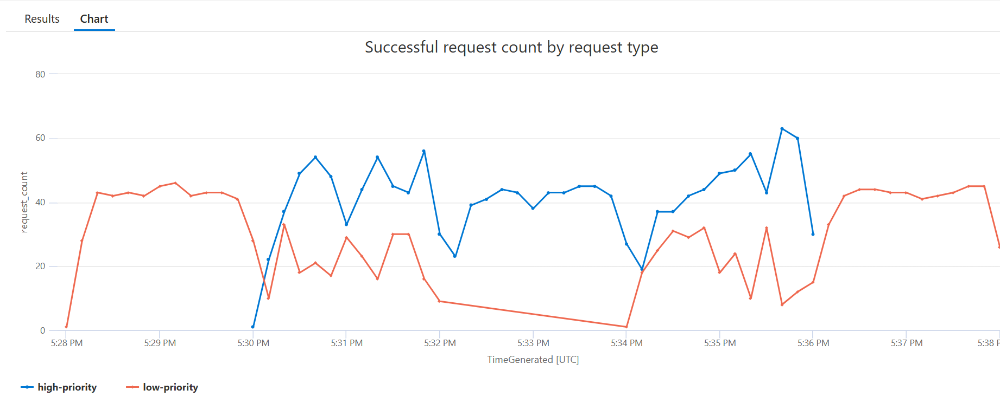
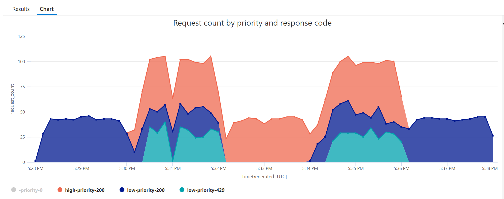
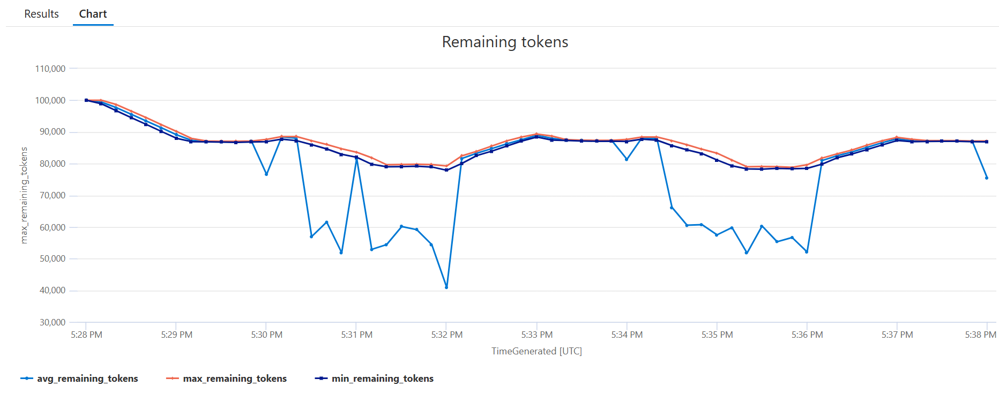
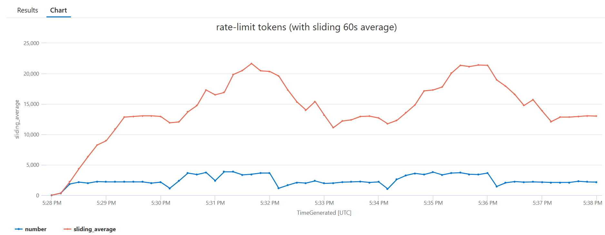
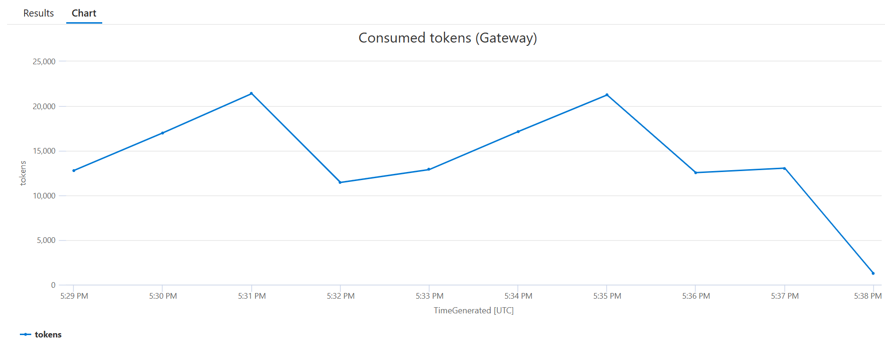

# Prioritization - Token Calculating

## Capability

In this capability we have different priorities of request (high and low).
High priority requests should always be allowed through to the backend, whie low priority requests should be allowed through only if there is sufficient spare capacity remaining.

## How the policy works

The general flow for the prioritization policy is as follows:
1. Tokens-per-minute and requests-per-10-seconds values are retrieved for the deployment passed in the request.
2. The number of tokens utilized by the request are calculated using the same methods Azure Open AI Service [uses to compute the values for rate limiting purposes internally](https://learn.microsoft.com/azure/ai-services/openai/how-to/quota?tabs=rest#understanding-rate-limits). 
3. The policy checks that there is capacity for the request using the selected deployment's token and request limits and rejects requests beyond those limits with a 429 response.
4. Assuming there is available capacity, the policy checks the priority of the request. Low priority requests are identified by either an `priority` query parameter or an `x-priority` header with a value of `low`.
5. If the request is a high priority request, it will be passed through to the backend.
6. If the request is a low priority request, the policy checks if there is sufficient spare capacity to allow the request through. If there is sufficient capacity, the request is allowed through to the backend. Otherwise it is rejected with a 429 response.

### Prioritization configuration

The first step of the prioritization processing is retrieving the token and request limits plus the level of spare capacity to reserve for a given deployment. `tpm-limit` and `rp10s-limit` value should be set for each deployment, as well as a `low-priority-tpm-threshold` and `low-priority-rp10s-threshold` values to set the number of tokens and requests, respectively, that should unavailable fpr low priority requests.

```xml
<cache-lookup-value key="list-deployments" variable-name="list-deployments" />
<choose>
    <when condition="@(context.Variables.ContainsKey("list-deployments") == false)">
        <!-- when remaining tokens/requests goes under the low priority threshold, low-priority requests are disallowed  -->
        <set-variable name="list-deployments" value="@{
            JArray deployments = new JArray();
            deployments.Add(new JObject()
            {
                { "deployment-id", "embedding" },
                { "tpm-limit", 10000},
                { "low-priority-tpm-threshold", 3000},
                { "rp10s-limit", 10 },
                { "low-priority-rp10s-threshold", 3},
            });
            deployments.Add(new JObject()
            {
                { "deployment-id", "embedding100k" },
                { "tpm-limit", 100000},
                { "low-priority-tpm-threshold", 30000},
                { "rp10s-limit", 100 },
                { "low-priority-rp10s-threshold", 30},
            });
            deployments.Add(new JObject()
            {
                { "deployment-id", "gpt-35-turbo-10k-token" },
                { "tpm-limit", 10000},
                { "low-priority-tpm-threshold", 3000},
                { "rp10s-limit", 10 },
                { "low-priority-rp10s-threshold", 3},
            });
            deployments.Add(new JObject()
            {
                { "deployment-id", "gpt-35-turbo-100k-token" },
                { "tpm-limit", 100000},
                { "low-priority-tpm-threshold", 30000},
                { "rp10s-limit", 100 },
                { "low-priority-rp10s-threshold", 30},
            });
            return deployments;   
        }" />
        <cache-store-value key="list-deployments" value="@((JArray)context.Variables["list-deployments"])" duration="60" />
    </when>
</choose>
```

### Calculating consumed tokens

The policy calculates the number of tokens that Azure Open AI Service will compute for the request. Embeddings and chat completion requests are calculated differently:

```xml
<set-variable name="consumed-tokens" value="@{
    JObject requestBody = context.Request.Body.As<JObject>(preserveContent: true);
    if(context.Operation.Id == "embeddings_create" || requestBody.Value<string>("model") == "embedding"){
        return (int)Math.Ceiling((requestBody.Value<string>("input")).Length * 0.25);
    } else {
        if(requestBody.ContainsKey("max_tokens") && requestBody.ContainsKey("best_of")) {
            return requestBody.Value<int>("max_tokens") * requestBody.Value<int>("best_of");
        } 
        else if(requestBody.ContainsKey("max_tokens"))
        {
            return requestBody.Value<int>("max_tokens");
        }
        else
        {
            return 16;
        }
    }
}" />
```

### Rate limiting and calculating remaining tokens

Deployment specific tokens-per-minute and requests-per-10-seconds limits are used to rate limit all incoming requests using the calculated consumed tokens and remaining capacity. Requests that exceed either limit receive 429s, while `remaining-tokens` and `remaining-requests` variables are set for use in subsequent statements.

```xml
<rate-limit-by-key counter-key="@(context.Variables["selected-deployment-id"] + "|tokens-limit")"
    calls="@((int)context.Variables["tpm-limit"])"
    renewal-period="60"
    increment-count="@((int)context.Variables["consumed-tokens"])"
    increment-condition="@(context.Response.StatusCode != 429)"
    retry-after-header-name="x-apim-tokens-retry-after"
    retry-after-variable-name="tokens-retry-after"
    remaining-calls-header-name="x-apim-remaining-tokens" 
    remaining-calls-variable-name="remaining-tokens"
    total-calls-header-name="x-apim-total-tokens"/>
<rate-limit-by-key counter-key="@(context.Variables["selected-deployment-id"] + "|requests-limit")"
    calls="@((int)context.Variables["rp10s-limit"])"
    renewal-period="10"
    increment-condition="@(context.Response.StatusCode != 429)"
    retry-after-header-name="x-apim-requests-retry-after"
    retry-after-variable-name="requests-retry-after"
    remaining-calls-header-name="x-apim-remaining-requests"
    remaining-calls-variable-name="remaining-requests"
    total-calls-header-name="x-apim-total-requests"/>
```

### Determining request priority

Low priority requests are denoted by the presence of a `priority` query string parameter or `x-priority` header set to `low`:

```xml
<set-variable name="low-priority" value="@{
    if (context.Request.Url.Query.GetValueOrDefault("priority", "") == "low"){
        return true;
    }
    if (context.Request.Headers.GetValueOrDefault("x-priority", "") == "low"){
        return true;
    }
    return false;
    }" />
```

### Rate limiting low priority requests

The policy checks that the `remaining-tokens` and `remaining-requests` are above the defined low priority thresholds for the selected deployment, returning 429s for requests that fall below those thresholds:

```xml
<choose>
    <when condition="@((int)context.Variables["remaining-tokens"] < (int)context.Variables["low-priority-tpm-threshold"])">
        <return-response>
            <set-status code="429" reason="Too Many Tokens" />
            <set-header name="x-gw-ratelimit-reason" exists-action="override">
                <value>tokens-below-low-priority-threshold</value>
            </set-header>
            <!-- return the current value in the logs - useful for validation/debugging -->
            <set-header name="x-gw-ratelimit-value" exists-action="override">
                <value>@(((int)context.Variables["remaining-tokens"]).ToString())</value>
            </set-header>
            <set-body>Low priority rate-limiting triggered by token usage</set-body>
        </return-response>
    </when>
    <when condition="@((int)context.Variables["remaining-requests"] < (int)context.Variables["low-priority-rp10s-threshold"])">
        <return-response>
            <set-status code="429" reason="Too Many Requests" />
            <set-header name="x-gw-ratelimit-reason" exists-action="override">
                <value>requests-below-low-priority-threshold</value>
            </set-header>
            <!-- return the current value in the logs - useful for validation/debugging -->
            <set-header name="x-gw-ratelimit-value" exists-action="override">
                <value>@(((int)context.Variables["remaining-requests"]).ToString())</value>
            </set-header>
            <set-body>Low priority rate-limiting triggered by requests usage</set-body>
        </return-response>
    </when>
</choose>
```

## How to see this in action

To see this policy in action, first deploy the accelerator using the instructions [here](../../README.md) setting the `USE_SIMULATOR` value to `true`.
This will deploy OpenAI API simulators to enable testing the APIM policies without the cost of Azure OpenAI API calls.

Once the accelerator is deployed, open a bash terminal in the root directory of the repo and run `LOAD_PATTERN=cycle ENDPOINT_PATH=prioritization-token-calculating REQUEST_TYPE=chat MAX_TOKENS=50 ./scripts/run-end-to-end-prioritization.sh`. The command will run a prioritization end to end test against the token calculating endpoint, using chat requests with a `max_token` value set to `50`.

This script runs a load test that cycles between high and low priority requests sending chat requests:
- Initially, the script only sends low priority requests
- Then high priority requests are sent alongside the low priority requests
- Next, only high priority requests are sent
- Then low priority requests are sent alongside the high priority requests
- Finally, only low priority requests are sent

After the load test is complete, the script waits for the metrics to be ingested into Log Analytics and then queries the results.

The initial output from a test run will look something like this (the output shows the variation in test users at each step):



Once the metrics are ingested, the script will show the results of a number of queries that illustrate the behaviour (truncated for length):



For each of these queries, the query text is included, as well as a `Run in Log Analytics` link, which will take you directly to the Log Analytics blade in the Azure Portal so that you can run the query and explore the data further.

The first query shows the overall request count and shows that the number of requests increases when we have both high and low priority requests in the load pattern:



The next query shows the number of successful requests (i.e. with a 200 status response) split by priority. Here you can see that there are only successful low priority requests at the start and end of the test (when there are only low priority requests):



The third query shows all responses split by priority and response status code. This has more detail than the previous query and shows that there are 429 responses for low priority requests when there is not enough capacity available:



The next query shows the remaining tokens value (min/max/mean) over time, taken from the backend service response headers:



The next query uses metrics from the Azure OpenAI API simulator to show the rate limit token usage over time showing both the point in time value and the 60s sliding total. This is a useful way to evaluate the effectiveness of the policy:



The final query displays the `consumed-tokens` values that API Management tracks and uses to determine if there is available capacity for a given chat request.

