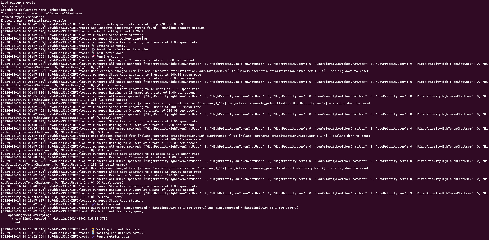
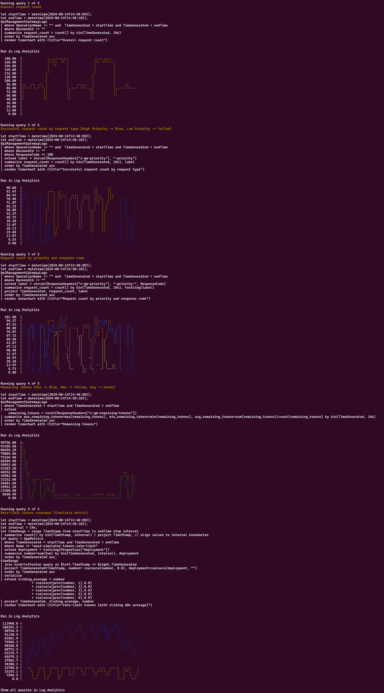
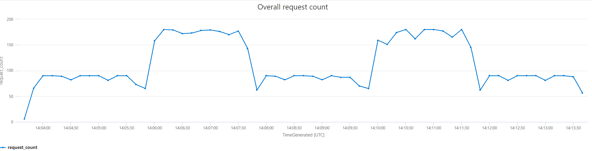
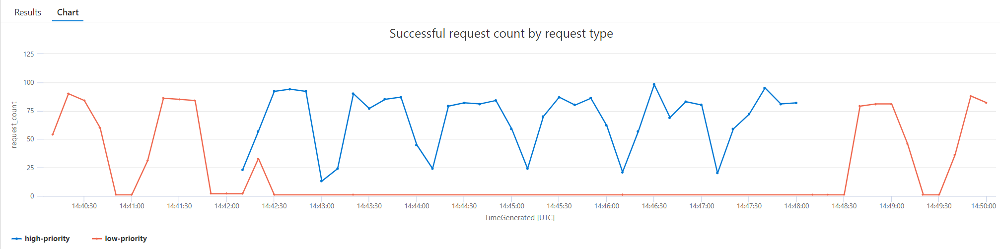
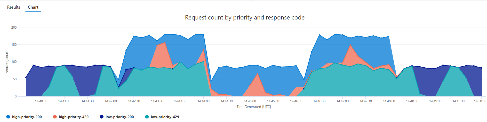
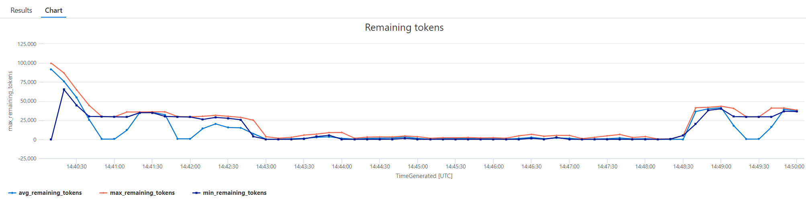
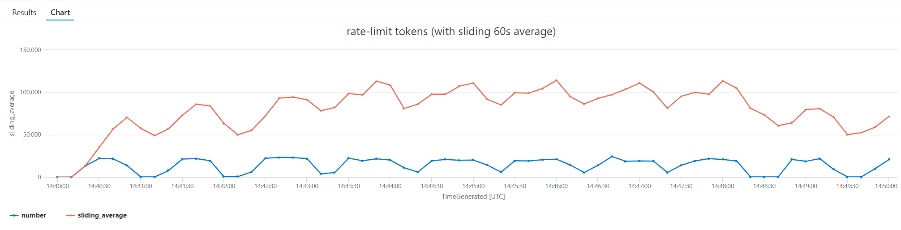

# Prioritization - Token Tracking - Embeddings Cycle Test

This doc describes the end-to-end test that cycles between high and low priority requests sending embeddings requests.
For details of the policy implementation and other tests, see the [Prioritization Token Tracking README](./prioritization-token-tracking.md).

## Running the test

To see this policy in action, first deploy the accelerator using the instructions [here](../../README.md) setting the `USE_SIMULATOR` value to `true`.
This will deploy OpenAI API simulators to enable testing the APIM policies without the cost of Azure OpenAI API calls.

Once the accelerator is deployed, open a bash terminal in the root directory of the repo and run `LOAD_PATTERN=cycle ENDPOINT_PATH=prioritization-token-tracking ./scripts/run-end-to-end-prioritization.sh`.

This script runs a load test that cycles between high and low priority requests sending embeddings requests:

- Initially, the script only sends low priority requests
- Then high priority requests are sent alongside the low priority requests
- Next, only high priority requests are sent
- Then low priority requests are sent alongside the high priority requests
- Finally, only low priority requests are sent

After the load test is complete, the script waits for the metrics to be ingested into Log Analytics and then queries the results.

The initial output from a test run will look something like this (the output shows the variation in test users at each step):

Once the metrics are ingested, the script will show the results of a number of queries that illustrate the behaviour:

For each of these queries, the query text is included, as well as a `Run in Log Analytics` link, which will take you directly to the Log Analytics blade in the Azure Portal so that you can run the query and explore the data further.

The first query shows the overall request count and shows that the number of requests increases when we have both high and low priority requests in the load pattern:

The next query shows the number of successful requests (i.e. with a 200 status response) split by priority. Here you can see that there are only successful low priority requests at the start and end of the test (when there are only low priority requests):

The third query shows all responses split by priority and response status code. This has more detail than the previous query and shows that there are 429 responses for low priority requests when there is not enough capacity available:

The next query shows the remaining tokens value (min/max/mean) over time. This is the value from the backend service response headers that is used to determine the available capacity for a given deployment:

The final query uses metrics from the Azure OpenAI API simulator to show the rate limit token usage over time showing both the point in time value and the 60s sliding total. This is a useful way to evaluate the effectiveness of the policy:

