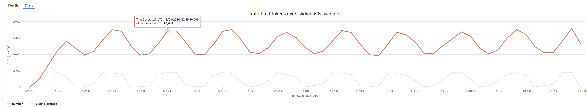

# Prioritization - Token Tracking

- [Prioritization - Token Tracking](#prioritization---token-tracking)
 	- [Capability](#capability)
 	- [How to see this in action](#how-to-see-this-in-action)
 	- [How the policy works](#how-the-policy-works)
  		- [Prioritization configuration](#prioritization-configuration)
  		- [Managing low-priority only requests](#managing-low-priority-only-requests)

## Capability

In this capability we have different priorities of request (high and low).
High priority requests should always be allowed through to the backend, while low priority requests should be allowed through only if there is sufficient spare capacity remaining.

For details of how this implementation compares to the other implementations, see the the [main prioritization README](./README.md).

## How to see this in action

Due to the complexity of this capability, there are a number of end-to-end tests that can be run to see the policy in action:

- [Embeddings: single priority](./prioritization-token-tracking-embeddings-simple.md) - single priority requests, sending either just high or low priority requests
- [Embeddings: cycle test](./prioritization-token-tracking-embeddings-cycle.md) - cycles between high and low priority requests sending embeddings requests

## How the policy works

The general approach to the token tracking prioritization implementation is to use the `x-ratelimit-remaining-tokens` and `x-ratelimit-remaining-requests` headers that the Azure OpenAI service returns to determine the available capacity for a given deployment.

The rough flow for the prioritization policy is as follows:

1. The policy checks the priority of the request. Low priority requests are identified by either an `priority` query parameter or an `x-priority` header with a value of `low`.
2. If the request is a low priority request, the policy checks if there is sufficient available capacity to allow the request through.
3. If there is sufficient spare capacity, the request is allowed through to the backend. Otherwise it is rejected with a 429 response.
4. When a response is received from the backend, the policy retrieves the `x-ratelimit-remaining-tokens` and `x-ratelimit-remaining-requests` headers and stores this in the API Management cache. These values are used to determine available capacity the when the next request is received.

The full implementation can be found in `prioritization-token-tracking.xml`.
There are a few aspects of the policy implementation that are worth digging into further and these are covered in the following sections.

### Prioritization configuration

The first step of the prioritization processing is determining the level of spare capacity to reserve for a given deployment.
This is achieved by setting a `low-priority-tpm-threshold` and `low-priority-rp10s-threshold` value for each deployment to set the number of tokens and requests respectively that should be available for a low priority request to be processed.

```xml
<cache-lookup-value key="list-deployments" variable-name="list-deployments" />
<choose>
	<when condition="@(context.Variables.ContainsKey("list-deployments") == false)">
		<set-variable name="list-deployments" value="@{
			JArray deployments = new JArray();
			deployments.Add(new JObject()
			{
				{ "deployment-id", "embedding100k" },
				// embedding100k has a 100,000 TPM limit
				// Set low-priority-tpm-threshold to 30,000 to reserve 30,000 TPM for high priority requests
				// 100,000 TPM  = 6/1000 * 100,000 = 600 RPM
				//              = 10 RP10S (requests per 10 seconds)
				{ "low-priority-tpm-threshold", 30000},
				{ "low-priority-rp10s-threshold", 3},
			});
			deployments.Add(new JObject()
			{
				{ "deployment-id", "embedding" },
				{ "low-priority-tpm-threshold", 3000},
				{ "low-priority-rp10s-threshold", 3},
			});
			deployments.Add(new JObject()
			{
				{ "deployment-id", "gpt-35-turbo-10k-token" },
				{ "low-priority-tpm-threshold", 3000},
				{ "low-priority-rp10s-threshold", 3},
			});
			deployments.Add(new JObject()
			{
				{ "deployment-id", "gpt-35-turbo-20k-token" },
				{ "low-priority-tpm-threshold", 3000},
				{ "low-priority-rp10s-threshold", 3},
			});
			return deployments;   
		}" />
		<cache-store-value key="list-deployments" value="@((JArray)context.Variables["list-deployments"])" duration="60" />
	</when>
</choose>
```

Once the deployment configuration is retrieved, the values for the current request are determined using the deployment ID from the request path.

### Managing low-priority only requests

Since this implementation uses the `x-ratelimit-remaining-tokens` and `x-ratelimit-remaining-requests` headers to determine the available capacity, it is essentially basing the decision to allow a low-priority request through on the remaining capacity reported after the last request was processed.
This can lead to periods where low-priority requests are not processed even though there is actually spare capacity available in the backend.

For example, consider a period of time where there are only been low-priority requests.
At some point, the remaining capacity might drop below the configured threshold and subsequent low-priority requests will receive a 429 response.
The cached capacity value is only updated when a response is received from the backend, but low-priority requests are blocked and there are no high-priority requests in this scenario.
This situation continues until the cached capacity value expires (60s for tokens), resulting in a 60s window where no requests are processed.
This cycle can repeat indefinitely if there are no high-priority requests to trigger an update to the cached capacity value, as shown in the following chart.


The configuration for the deployment being tested in the previous chart has 100,000 tokens per minute (TPM) available and reserves 30,000 for high-priority requests.
In this scenario (low-priority requets only), that allows for up to 70,000 TPM for low-priority requests.
Using the metrics from the API simulator, we can see that in the following chart that the 60s average TPM peaks at around 70,000 TPM and then drops to around 25,000 TPM by the time low-priority requests are resumed.
This results in a much lower rate of low-priority requests than would be expected from the configuration.


To address this issue, the policy uses a `allow-additional-lowpri-request` cache value.
Whenever there is a low-priority request and the cached capacity value is below the threshold, the policy checks the `allow-additional-lowpri-request` value.
If this value is not present in the cache then an additional low-priority request is allowed through which enables the gateway to update the cached capacity value.
Whenever there is a successful request, this value is set to `false` with a 10s expiry time which ensures that we wait 10s before allowing one of the additional low-priority requests through.
The following chart shows the impact of this additional request on the processing of low-priority requests.


In the previous chart, there are still periods where low-priority requests are blocked, but these are much shorter than in the previous chart.
In particular, note that there is only a single 10s data point where there are no low-priority requests processed.
Allowing the additional requests has a positive impact on the responsiveness of the gateway to low-priority requests when there are no high-priority requests, but it does come at the cost of intermittently allowing higher low-priority usage than the configured threshold.
This can be seen in the following chart.


