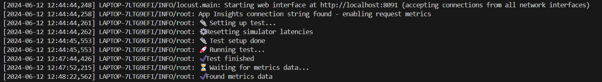
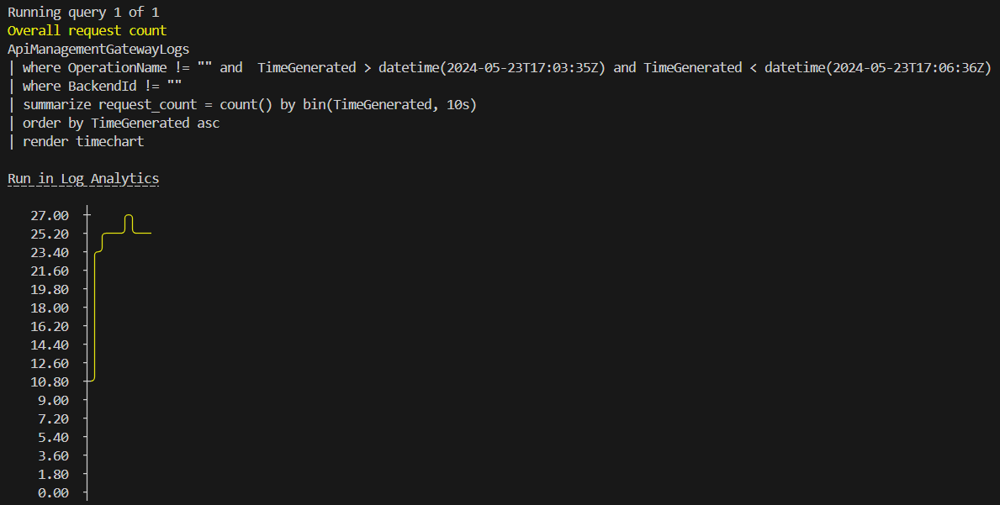
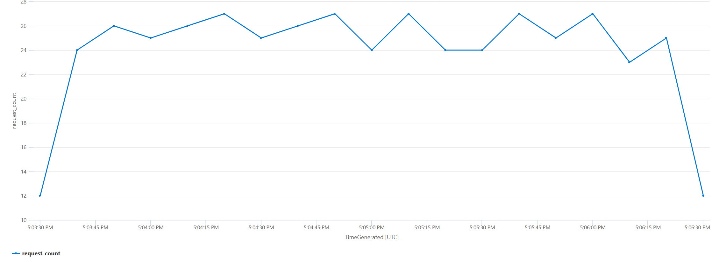
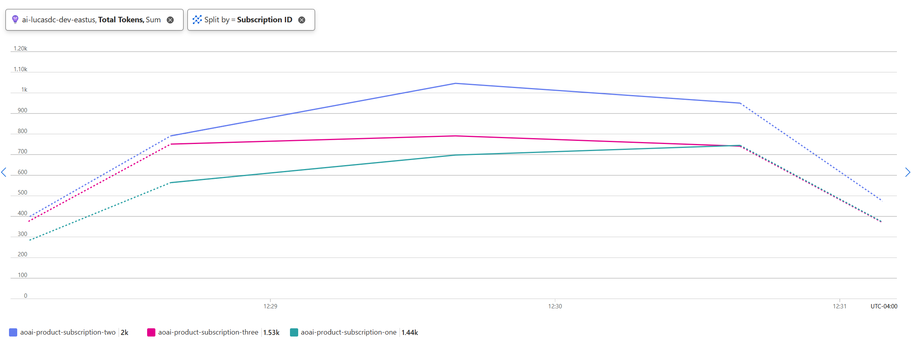

# Usage tracking using Azure Event Hub

## Capability

In this capability, token usage data is tracked in Azure Monitor and sent to Event Hubs for chargeback processing. Message sent to event hub includes, SubscriptionId, TokenUsage, OperationName, RequestId.

### Azure Event Hubs vs Azure Monitor Custom Metrics

Token consumption is tracked in Azure Monitor for monitoring purposes. But sending the data to Azure EventHub adds the following advantages:

- Event Hubs are the more reliable transmission option for critical transactional data involved in organizational chargeback.
- There are varied options to consume the data from EventHub for further processing, like Azure Stream Analytics, Azure Functions, Logic Apps, etc.
- The event streams will be near real time, in comparison to Azure Monitor.

## How the policy works

- Azure OpenAI response will contain the token usage data. This policy extracts the token usage data from the response and sends it to Azure Event Hub.
- Token counts are automatically exported to Azure Monitor.

## How to see this in action

To see this policy in action, first deploy the accelerator using the instructions [here](../../README.md) setting the `USE_SIMULATOR` value to `true`.
This will deploy OpenAI API simulators to enable testing the APIM policies without the cost of Azure OpenAI API calls.

Once the accelerator is deployed, open a bash terminal in the root directory of the repo and run `./scripts/run-end-to-end-usage-tracking.sh`.

This script runs a load test for 3 minutes which repeatedly sends requests to the OpenAI simulator via APIM using the usage tracking policy.
Requests are sent using each of the 3 APIM subscription keys and use a random max_token value between 5 and 20.
The three subscriptions should consume different token amounts over the course of the test.

After the load test is complete, the script waits for the metrics to be ingested into Log Analytics and then queries the results.

The initial output from a test run will look something like this:

Once the metrics have been ingested, the script will show query results that display the overall request count over time:

The query text is included, as well as a `Run in Log Analytics` link, which will take you directly to the Log Analytics blade in the Azure Portal so that you can run the query and explore the data further.

The query in this example shows the total number of requests sent to APIM:

The script includes a a `View Token Metrics in Log Analytics` link that displays the total token usage data over time for each of the three APIM subscriptions. In this chart, you can see that the different subscriptions consumed varying levels of tokens over the course of the test:

