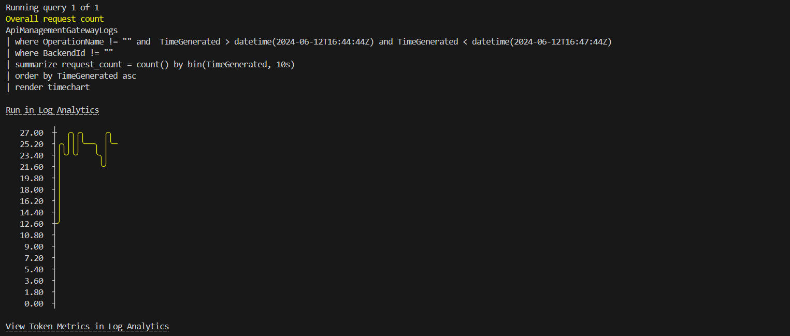
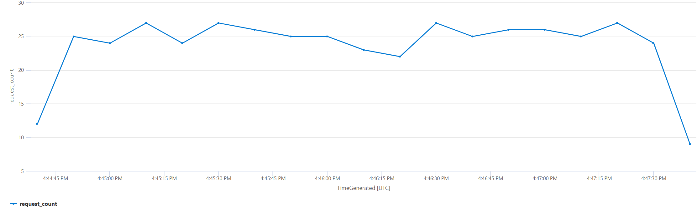

# Usage tracking using Azure Event Hub

## Capability

In this setup, you can track the usage of your APIs by sending token usage data to Azure Event Hub. Message sent to event hub includes, SubscriptionId, TokenUsage, OperationName, RequestId.

### Azure EventHub over Custom Metrics to Azure Monitor

It is also possible to track the token consumption by sending the token count as a metrics to the Azure monitor.

But Azure EventHub adds the following advantages:

- It is possible to track some additional context (in form of text) other than just numbers like in metrics.
- The event streams will be near real time, in comparison to Azure monitor.
- Varied opportunities to consume the data from EventHub for further processing, like Azure Stream Analytics, Azure Functions, Logic Apps, etc.

## How the policy works

- Azure OpenAI response will contain the token usage data. This policy extracts the token usage data from the response and sends it to Azure Event Hub.
- This policy fragment needs to be included in the `outbound` section of the APIM policy.

## How to see this in action

To see this policy in action, first deploy the accelerator using the instructions [here](../../README.md) setting the `USE_SIMULATOR` value to `true`.
This will deploy OpenAI API simulators to enable testing the APIM policies without the cost of Azure OpenAI API calls.

Once the accelerator is deployed, open a bash terminal in the route directory of the repo and run `./scripts/run-end-to-end-usage-tracking.sh`.

This script runs a load test for 3 minutes which repeatedly sends requests to the OpenAI simulator via APIM using the usage tracking policy.
Requests are sent using each of the 3 APIM subscription keys and use a random max_token value between 5 and 20. 
The three subscriptions should consume different token amounts over the course of the test. 

After the load test is complete, the script waits for the metrics to be ingested into Log Analytics and then queries the results.

The initial output from a test run will look something like this (this output shows the result of the usage tracking policy):

Once the metrics have been ingested the script will show query results that display the overall request count over time (additional queries on repo backlog):

The query text is included as well as a `Run in Log Analytics` link, which will take you directly to the Log Analytics blade in the Azure Portal, so that you can run the query and explore the data further.

The query can also been viewed in Log Analytics:

