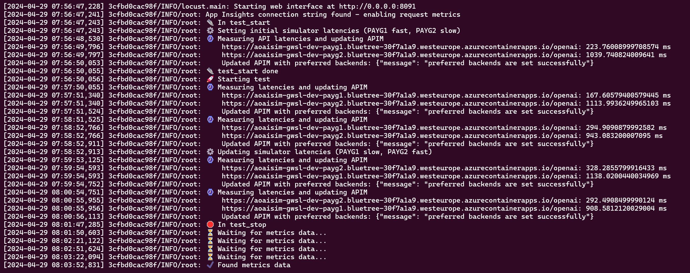
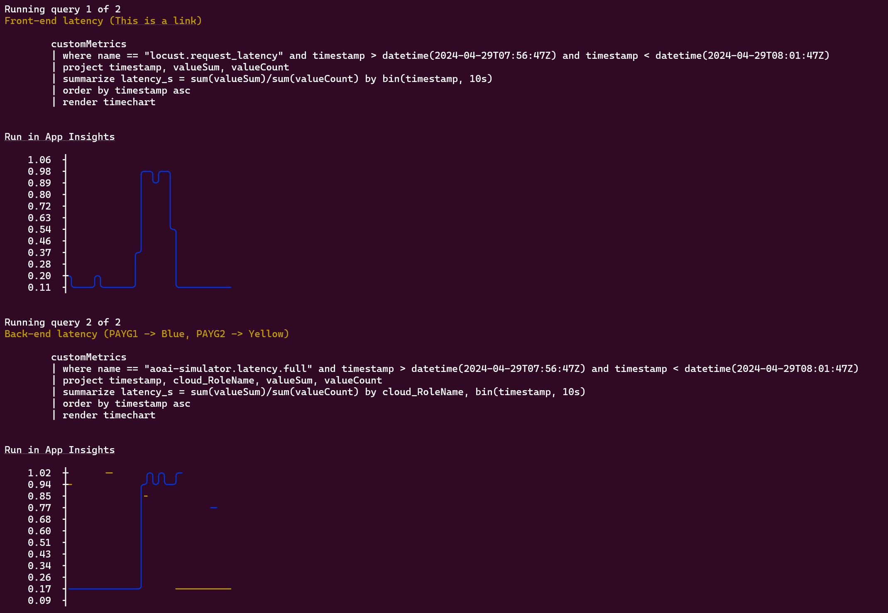
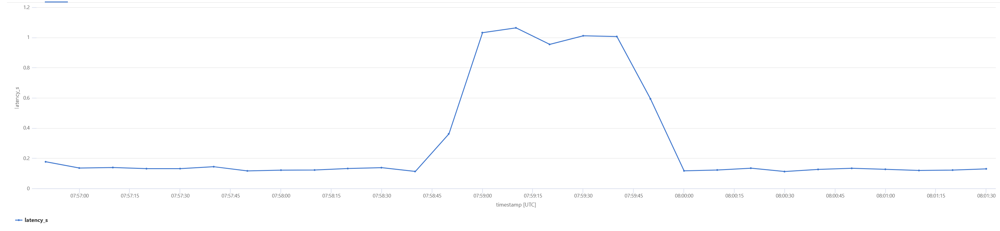
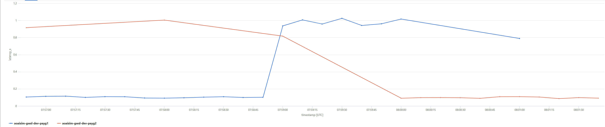

# Latency based routing

## Scenario

In this scenario, an external script will define the preferred instance to route the request based on the latency. APIM will then route the request to the preferred instance.

## How the policy works

- Using the `set-preferred-backends` API, the preferred backends are stored in the cache. The preferred backends are an array of URLs of the host in the preferred order.
- The `latency-routing` policy will use the `preferred-backends` array from cache to route the request to the preferred instance.
- In cases, where the `preferred-instance` responds back with 429s, the request will then be routed to the second preferred instance.

## How to see this in action

To see this policy in action, first deploy the accelerator using the instructions [here](../../README.md) setting the `USE_SIMULATOR` value to `true`.
This will deploy OpenAI API simulators to enable testing the APIM policies without the cost of Azure OpenAI API calls.

Once the accelerator is deployed, open a bash terminal in the `policies/latency-routing` directory and run `./scripts/run-scenario.sh`.

This script runs a load test for 5 minutes which repeatedly sends requests to the OpenAI simulator via APIM using the  latency routing policy.

1. When the script starts, it configures the latencies for the simulated APIs so that PAYG1 is fast and PAYG2 is slow.

2. Every minute the script measures the latency of the back-end APIs and calls the `set-preferred-backends` endpoint in APIM to pass the ordered list of backends (fastest first). In a real implementation this would be a separate component that runs as a scheduled job.

3. Two minutes into the test, the script re-configures the simulator latencies so that PAYG1 is slow and PAYG2 is fast. This occurs just after the back-end latencies are measured so there is a minute of the test where the APIM latency information is stale. During this time the request latency via APIM will be higher.

4. A minute after the back-end latencies were re-configured, the latencies are measured again and the `set-preferred-backends` endpoint is called to pass the new ordered list of backends. After this point, the latency of calls via APIM is reduced as the policy is routing to the current faster API.

After the load test is complete, the script waits for the metrics to be ingested into Application Insights and then queries the results.

The initial output from a test run will look something like this:

In the above output you can see each of the steps outlined in the description of the test steps.
Notices that after the `Updating simulator latencies` output, the order of the backends is changed and the PAYG2 endpoint is now listed first (and with the lower latency).

Once the metrics have been ingested the script will show the results of a couple of queries that illustrate the behaviour:

For each of these queries the query text is included as well as a `Run in App Insights` link which will take you directly to the Application Insights blade in the Azure Portal so that you can run the query and explore the data further.

The first query shows the mean request latency for requests sent via the APIM gateway.
In this chart you can see the spike that occurs after the back-end latencies are re-configured and before APIM is updated with the latest latency data:

The second query shows the mean request latency of each of the back-end APIs (i.e. the simulated OpenAI endpoints):

